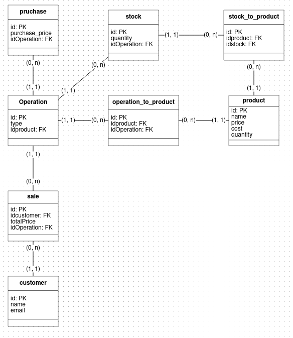

# Desafio6-DNC---Backend-Ecommerce
Projeto criado para atender o desafio enviado pela DNC como parte do processo de aprendizado

## Conteudos
- Workflow
- Modelagem

## Workflow
1. Criar projeto
2. Configurar para Typescript
3. Configurar Swagger

## Modelagem

