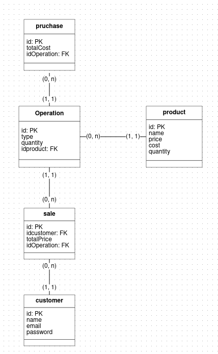

# Desafio6-DNC---Backend-Ecommerce
Projeto criado para atender o desafio enviado pela DNC como parte do processo de aprendizado

## Conteudos
- [Workflow](#workflow)
- [Observação](#observação)
- [Modelagem](#modelagem)
- [Tecnologias](#tecnologias)

## Workflow
1. Criar projeto
2. Configurar para Typescript
3. Configurar Swagger
4. Modelar Dados
5. Configurar DB
6. Criar Rotas

## Observação
A relação entre as tabelas de purchase and sales não pode ser feita diretamente com o comando do Prisma, pois o SQLite não suporta a criação de relação quando há mais de um item relacionado (CreateMany). Para evitar o uso de algoritimos de repetição, e a própria repetição de códigos em excesso, implementei o Axios, pois assim posso reutilizar as validações já feitas na própria rota de criação de operações.

## Modelagem

## Tecnologias

- Typescript - Linguagem tipada baseada em Javascript
- Node - Ambiente de execução do Javascript
- Express - Framework para Node
- Swagger - Para gerar documentação dinâmica do projeto
- Prisma - ORM para controle de Bancos de Dados
